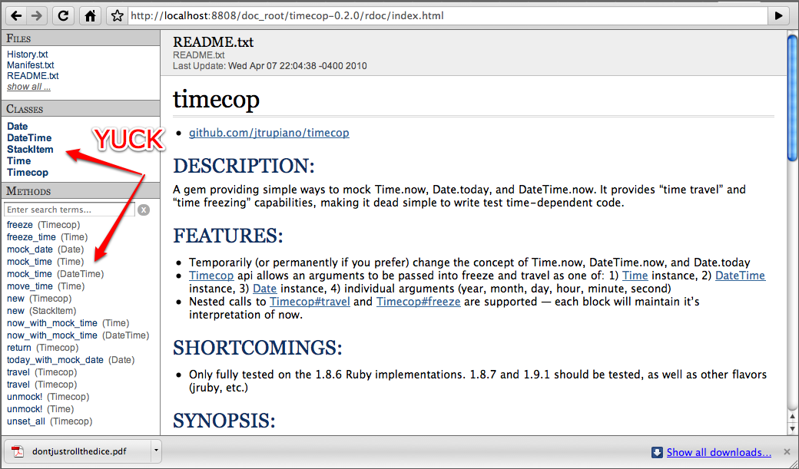
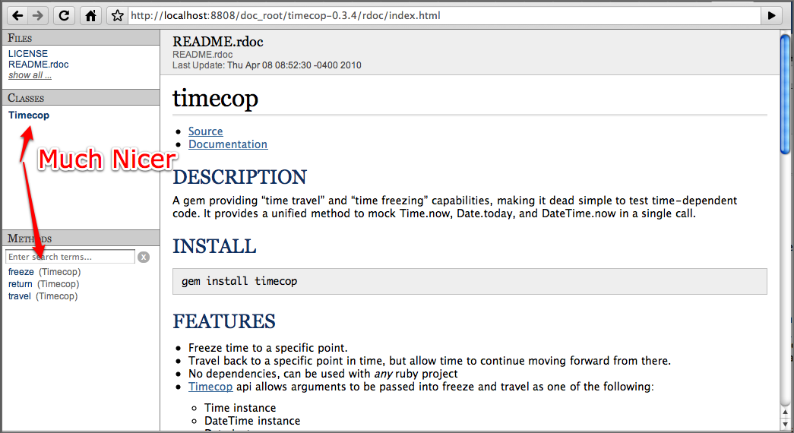
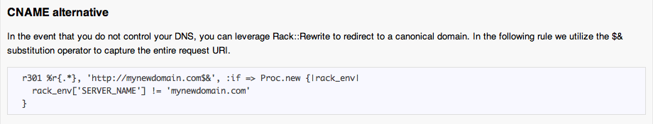

!SLIDE
# Documentation

!SLIDE
# Plan Your Public API

!SLIDE bullets incremental
# RDoc and YARD are Your Friends Here

* Get a documented public API for free
* Use #:nodoc: to hide the private API
* public/protected/private in code is just a matter of preference

!SLIDE
# Poor RDoc

!SLIDE center

!SLIDE
# Better RDoc

!SLIDE center

!SLIDE
# README

!SLIDE
# Show examples

!SLIDE
# Show lots of examples

!SLIDE
# Write tests for your examples too

!SLIDE center

!SLIDE smaller

    @@@ ruby
    context 'Given the CNAME alternative rewrite rule in our README' do
      setup do
        @rule = Rack::Rewrite::Rule.new(:r301, %r{.*}, 'http://mynewdomain.com$&', lambda {|rack_env|
          rack_env['SERVER_NAME'] != 'mynewdomain.com'
        })
      end
      
      should 'match requests for domain myolddomain.com and redirect to mynewdomain.com' do
        env = {'REQUEST_URI' => '/anything?abc=1', 'PATH_INFO' => '/anything', 'QUERY_STRING' => 'abc=1', 'SERVER_NAME' => 'myolddomain.com'}
        assert @rule.matches?(env)
        rack_response = @rule.apply!(env)
        assert_equal 'http://mynewdomain.com/anything?abc=1', rack_response[1]['Location']
      end
      
      should 'not match requests for domain mynewdomain.com' do
        assert !@rule.matches?({'REQUEST_URI' => '/anything', 'SERVER_NAME' => 'mynewdomain.com'})
      end
    end
    
!SLIDE
# Gem::Specification#post_install_message

!SLIDE
# Gem::Specification#post_install_message
## Communicate to your users

!SLIDE commandline incremental
# Gem::Specification#post_install_message

    $ gem install rvm
    ********************************************************************************

      In order to setup rvm for your user's environment you must now run rvm-install.
      rvm-install will be found in your current gems bin directory corresponding to where the gem was installed.

      rvm-install will install the scripts to your user account and append itself to your profiles in order to
      inject the proper rvm functions into your shell so that you can manage multiple rubies.

    ********************************************************************************
    Successfully installed rvm-0.1.26
    1 gem installed
    
